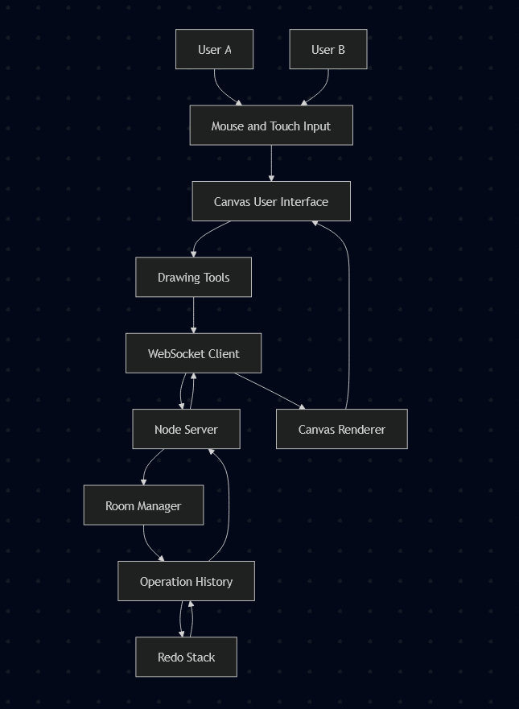

# Collaborative Canvas – Architecture

## System Overview

Collaborative Canvas uses a client-server real-time architecture based on WebSockets.

All drawing operations are:
Performed locally  
Sent to server  
Broadcast to other clients in the same room  
Replayed on remote canvases  

---
## Data Flow Diagram

## WebSocket Protocol

draw – client → server – drawing operation  
redraw – server → client – full history  
undo – client → server  
redo – client → server  
cursor – client → server – x,y  
users – server → client  

---

## Drawing Operations

Freehand:

{
  from: {x,y},
  to: {x,y},
  color,
  width,
  mode
}

Rectangle:

{
  type: "rect",
  x, y, w, h,
  color, width
}

Text:

{
  type: "text",
  text,
  x, y,
  color
}

---

## Undo / Redo

Each room maintains:

history[]  
redoStack[]  

Undo:
pop from history  
push to redoStack  
broadcast redraw  

Redo:
pop from redoStack  
push to history  
broadcast redraw  

---

## Conflict Resolution

Last-write-wins strategy.  
Server history is authoritative.

---

## Performance

Incremental drawing  
Redraw only on undo/redo  
Room-based isolation  
Pure WebSockets  

---

## Scaling

Move state to Redis  
Use namespaces  
Shard rooms  
Cluster workers  

---

## Mobile

touchstart → startPoint  
touchmove → draw  
touchend → finalize  

---

## Design

Single source of truth  
Deterministic replay  
Tool-agnostic protocol  
Optimistic rendering  
